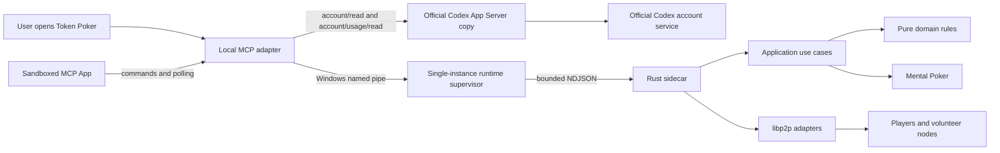

# Token Poker

[](https://github.com/rainyflash/token-poker/actions/workflows/ci.yml)
[](https://github.com/rainyflash/token-poker/releases/latest)
[](#license)

Token Poker is an experimental, Windows-first, peer-to-peer Texas Hold'em game that runs inside the official Codex plugin interface. Lifetime Token usage reported by the official Codex account API is used 1:1 as the maximum display-chip balance for each table. Wins and losses exist only within the current table; the next buy-in starts from the latest lifetime Token value again.

Chips cannot be purchased, withdrawn, transferred, redeemed, or converted into anything of value. This is not a real-money product.

## What is implemented

- An official Codex plugin with a sandboxed MCP App and fullscreen table; no DOM or CDP injection.
- An `account/usage/read` adapter. The table may request a refresh but cannot submit an arbitrary Token value.
- A local Rust sidecar for identity, public matchmaking, private rooms, game state, Mental Poker, and co-signed hand receipts.
- One shared runtime per Windows user. A game survives Codex task changes, and a new task can attach to the same table.
- Bayer-Groth verifiable shuffles, key-ownership proofs, private hole-card decryption shares, public-card reveals, and showdown verification.
- No-Limit Hold'em betting, all-ins, main and side pots, zero-sum settlement, dealer rotation, and a barrier between hands.
- Durable statistics derived from receipts signed by every participant instead of directly mutable counters.
- libp2p TCP/QUIC, Noise, Yamux, Kademlia, Gossipsub, Rendezvous, AutoNAT, DCUtR, and Circuit Relay v2.
- A community-node directory, bounded successful-node cache, explicit volunteer consent, Windows metered-network and power probes, and bounded relay capacity.
- Encrypted remote recovery copies protected by a recovery phrase. Regular player devices do not persist root identity keys, device private keys, or hand receipts.
- A Codex-style responsive interface with English and Simplified Chinese localization, automatic system-language detection, and a persistent manual override.

The project is compilable and covered by automated protocol tests, but its cryptography has not received an independent production audit. The project does not operate a centralized matchmaking, game, or account server. Community discovery, relay, and archive capacity is supplied by volunteers.

## Install

Download the Windows x64 ZIP from the [latest release](https://github.com/rainyflash/token-poker/releases/latest), fully extract it into a normal folder, and double-click:

```text
Install Token Poker.cmd
```

The entrypoint validates that the extracted package is complete, automatically chooses install, repair, or upgrade, and keeps the result visible. It does not request administrator access or require `codex` on `PATH`. Its log is stored at `%LOCALAPPDATA%\TokenPoker\logs\installer.log`.

PowerShell remains available as a diagnostic fallback:

```powershell
powershell -NoProfile -ExecutionPolicy Bypass -File .\install-token-poker.ps1
```

Fully restart Codex after installation, create a new task, and ask:

```text
Open Token Poker and read my official lifetime Token.
```

The ZIP is a plugin package, not a standalone game launcher. Token Poker is always opened from inside Codex.

### Node.js and the Codex runtime

The plugin does not bundle Node.js, modify `PATH`, write Node-related registry entries, or replace an existing Node installation. It prefers the runtime managed by Codex and falls back to system Node only for source development.

During installation, the script locates the current Codex desktop App Server even when no Codex CLI command is registered. For Windows Store installations, it creates a verified temporary copy to run the official plugin commands, removes that bootstrap copy afterward, and keeps one copy in the versioned plugin cache for official usage reads. The installed runtime currently consumes roughly 284 MiB of local disk space. The binary comes from the user's existing Codex installation; it is not included in the release ZIP.

## Architecture



Dependencies point inward:

```text
Codex UI / MCP / network adapters -> application use cases -> domain
```

The domain layer has no dependency on React, Codex, MCP, libp2p, or storage implementations. Account usage, networking, archives, and the host UI are boundary adapters.

### Official Token data flow

1. The user opens Token Poker or selects refresh.
2. The MCP adapter starts a short-lived connection to the official Codex App Server binary prepared during installation.
3. The adapter completes the JSONL RPC handshake and calls `account/read` and `account/usage/read`.
4. Only a non-negative safe-integer `lifetimeTokens` value is accepted. Missing, estimated, or incompatible responses fail closed.
5. The sidecar keeps the normalized snapshot only in shared-runtime memory. It is never written into a hand archive or accepted from an arbitrary UI input.

The value is official server-side account usage data, but OpenAI does not provide a transferable signature for opponents to verify. Protocol records therefore explicitly mark the value as `peer_verifiable: false`.

## Identity and multiple devices

The Codex account and the Token Poker root identity are separate security domains:

- The normalized account identifier is hashed in local memory. The original email is not placed in UI events, network messages, receipts, or archives.
- Identity creation is automatic and idempotent after the account fingerprint becomes available.
- Root keys are unlocked only briefly to create a recovery package or issue a process-scoped device certificate.
- A second device needs both the same Codex account context and the recovery phrase. Signing in to Codex alone cannot decrypt a third-party root key.
- Device private keys disappear when the sidecar process exits. The project intentionally does not maintain a device revocation list.

## Decentralized networking

The project does not require an operator-owned matchmaking or game server. Clients may use:

- public or community Rendezvous and Kademlia bootstrap nodes;
- volunteer Circuit Relay nodes;
- volunteer encrypted identity and receipt archive nodes.

Volunteer service is opt-in. Metered networks and battery power suspend service. A relay role becomes active only after AutoNAT, an external address, UPnP, or dedicated-node configuration establishes public reachability. Docker-based dedicated nodes must explicitly advertise the public endpoints mapped to their container ports.

DCUtR hole punching is not guaranteed to succeed, so Circuit Relay remains a required fallback. If no community node is reachable, the local UI still opens, but public matchmaking and private rooms across NAT boundaries cannot cold-start. "No project-operated server" does not mean "no infrastructure."

See [Community node operations](./docs/COMMUNITY-NODE.md) for deployment details.

## Build and test

The repository pins contributor toolchains through `.node-version` and `rust-toolchain.toml`. These pins do not affect plugin users. Until `libp2p 0.57` is published, Cargo also pins an official `rust-libp2p` revision so the security-fixed Yamux and Hickory dependency graph is reproducible.

```powershell
cargo fmt --all -- --check
cargo clippy --workspace --all-targets --locked -- -D warnings
cargo test --workspace --locked
cargo check --manifest-path fuzz/Cargo.toml --bins --locked

Push-Location ui
npm ci
npm run build
npm run lint
npm test
Pop-Location

Push-Location plugins/token-holdem/mcp
npm ci
npm run build
npm test
Pop-Location

./scripts/check-syntax.ps1
python ./scripts/check-rust-security-baseline.py
python ./scripts/check-source-language.py
node --test scripts/community-network.test.mjs
node scripts/verify-volunteer-network.mjs
node scripts/verify-p2p-hand.mjs
node scripts/verify-complete-session.mjs
```

Build the unsigned Windows x64 plugin package with:

```powershell
python ./scripts/build-plugin.py
```

The `dist/` directory receives a deterministically assembled ZIP, its external SHA-256 file, and a machine-readable `latest.json` update manifest. Identical compiled inputs produce identical archives; compiler outputs may differ across build environments. Node.js, npm, `node_modules`, the Codex App Server, and development-only CDP tooling are excluded.

## Release channels and updates

Stable releases use tags in the form `vMAJOR.MINOR.PATCH`. GitHub Actions verifies that the tag matches every package manifest, runs the full build, and publishes exactly these assets:

- `token-poker-plugin-v<version>-windows-x64.zip`
- `token-poker-plugin-v<version>-windows-x64.zip.sha256`
- `latest.json`

The stable update manifest is available at:

```text
https://github.com/rainyflash/token-poker/releases/latest/download/latest.json
```

Token Poker checks this manifest when its UI opens. A user can download the release into isolated local staging, verify the declared size and SHA-256 digest, and explicitly confirm installation. A supervised PowerShell helper validates every archive path and package-manifest file before the existing Codex CLI installer replaces the plugin. Token Poker never overwrites its own running binaries. Manual bootstrap installations use the double-click CMD entrypoint; later updates continue through the in-app flow.

Versions 0.4.7 and earlier contain a Windows updater-launch defect and cannot reliably repair themselves online. Install 0.4.8 once with `Install Token Poker.cmd`; later stable releases can use the corrected in-app flow.

See [Plugin distribution](./docs/PLUGIN-DISTRIBUTION.md) for the release contract.

## Security boundaries

1. **Lifetime Token is not an opponent-verifiable credential.** The value comes from `account/usage/read`, but it is not signed for third-party verification.
2. **Codex login is not a third-party KMS.** Account context cannot silently grant ownership of a Token Poker root key.
3. **Mental Poker is unaudited.** The underlying `ziffle 0.1.0` crate and this protocol are suitable only for an experimental display-chip game.
4. **Serverless public matchmaking cannot eliminate Sybil attacks.** Persistent identities and co-signed history increase cost; they do not prove one human per identity.
5. **An unsigned ZIP checksum is integrity metadata, not publisher authentication.** Obtain releases from a trusted source.

Read the full [security model](./SECURITY.md), [matchmaking protocol](./docs/MATCHMAKING.md), and [continuous-hand protocol](./docs/HAND-PROTOCOL.md) before modifying protocol code.

## Contributing

Bug fixes, protocol review, test vectors, documentation, localization, and accessibility improvements are welcome. Read [CONTRIBUTING.md](./CONTRIBUTING.md), [CODE_OF_CONDUCT.md](./CODE_OF_CONDUCT.md), and [SECURITY.md](./SECURITY.md) before opening a pull request.

## License

Licensed under either of:

- [Apache License 2.0](./LICENSE-APACHE)
- [MIT License](./LICENSE-MIT)

at your option.
